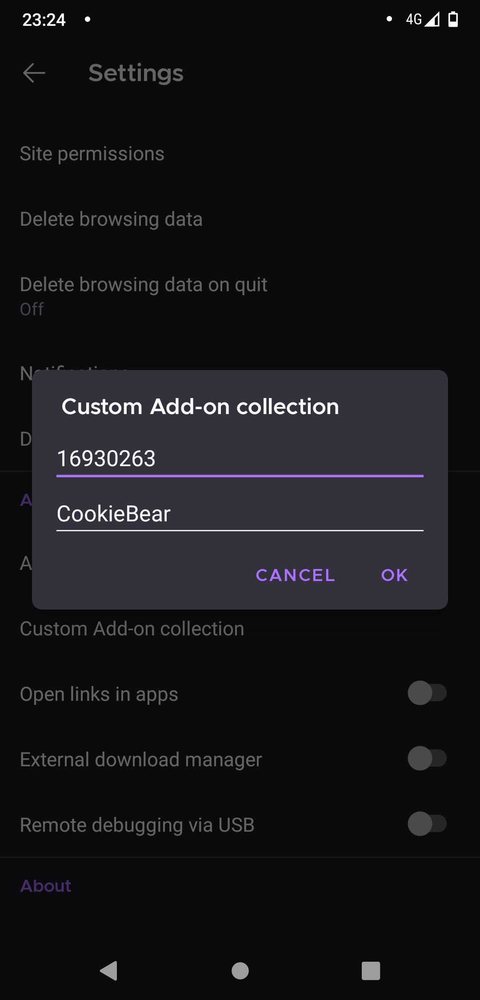

  

# BZCookieBear - Chrome / Firefox Extension
 Read Tamedia Abo Articles For Free
 
 
 

 The supported pages are can be found here https://consent.onelog.ch/.

 An excerpt:

 >BILANZ, Guider, Handelszeitung, Beobachter, Blick, Energy, L’illustré, Izzy Projects, lematin.ch, Moon&Stars, PME, Rockit Radio, Schlager Radio, Schweizer Illustrierte, Streaming, 20 Minuten, Vintage Radio, Basler Zeitung, 24 heures, Berner Oberländer, BZ Berner Zeitung, Bilan, Der Bund, Der Landbote, Femina, Finanz und Wirtschaft, BZ Langenthaler Tagblatt, Le Matin Dimanche, Schweizer Familie, Sihltaler, SonntagsZeitung, Tages-Anzeiger, Tamedia, Thalwiler Anzeiger, Thuner Tagblatt, Tribune de Genève, 12-App, Zürcher Unterländer und Zürichsee-Zeitung. 

 
 # Manual

 Install the extension from the links above.

 When you open any of the above listed pages and then click on their respective login button, the addon will automatically log you in. Some pages require some more information that you might have to fill out manually with random stuff.

 ## Credentials Page

 If you don't want to use the Addon you can find credentials here:  https://jsalamander.github.io/BZCookieBear/

## Installation on Android
Currently, mobile Browsers do not really support extensions as they do for their desktop counterparts.
To run **BZCookieBear** on your phone you need to install Firefox first, and enable a custom plugin collection.

### How To

#### 1. Install Firefox Nightly
Install [Firefox Nightly](https://play.google.com/store/apps/details?id=org.mozilla.fenix&hl=en&gl=US) on you Android device

#### 2. Enable Developer Menu
[Enable the developer Menu](https://blog.mozilla.org/addons/2020/09/29/expanded-extension-support-in-firefox-for-android-nightly/): Go to **Settings** -> **About Firefox Nightly** -> Tap the Firefox logo five times

#### 3. Activating The Custom Addon Collection
Navigate back to the **Settings** page and click on the menu entry **Custom Add-on collection**.
Enter the following details into the form:

**Collection Owner (User ID):** `16930263`

**Collection Name:** `CookieBear`

Click `ok`.

Now you need to install the addon by navigating clicking the three dots 
on the main menu in the navigation bar. Then go to **Add-ons** and activate it.
Accept all subsequent popups.

**That's it - have fun using BZCookieBear on you Android device.**

# API
The extension communicates with [BZCookieBakery](https://github.com/jsalamander/BZCookieBakery) which distributes the random account credentials used to authenticate.
