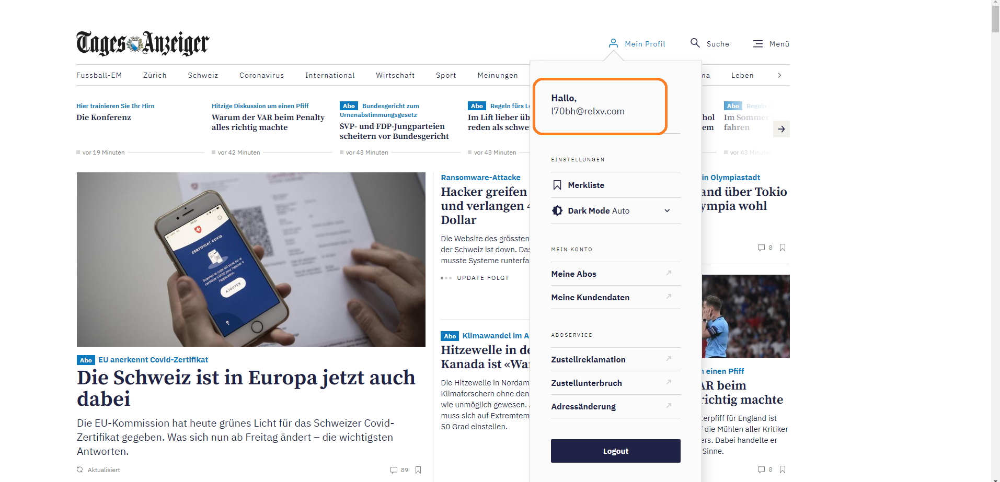

  

# BZCookieBear - Chrome / Firefox Extension
 Read Tamedia Abo Articles For Free
 
 
 

 The supported pages are:
 
  * www.bernerzeitung.ch
  * www.24heures.ch
  * www.bazonline.ch
  * www.berneroberlaender.ch
  * www.tagesanzeiger.ch
  * www.derbund.ch
  * www.landbote.ch
  * www.langenthalertagblatt.ch
  * www.zsz.ch
  * www.thunertagblatt.ch
  * www.tdg.ch
  * www.zuonline.ch

 
 # Manual

 Install the extension from the links above.

 When you open any of the above listed pages, the addon will automatically log you in. This might take some time.
 If you installed the addon while having one of the above pages open in a tab, you might need to reload the page.

After that you'll be able to read Abo articles and you can see that you are logged in as a random user.

If the random session is not valid anymore it will automatically fetch a new one.

# API
The extension communicates with [BZCookieBakery](https://github.com/jsalamander/BZCookieBakery) which delivers the cookies used to authenticate.
