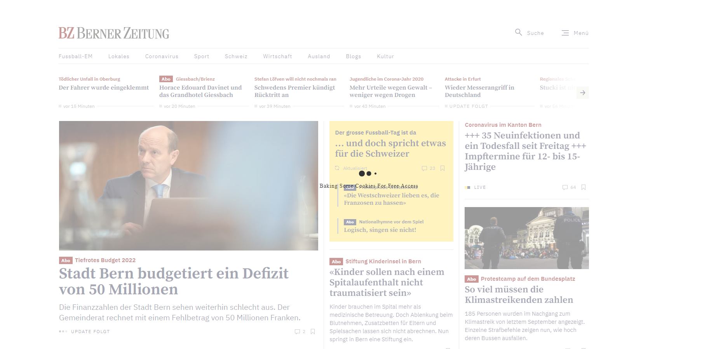
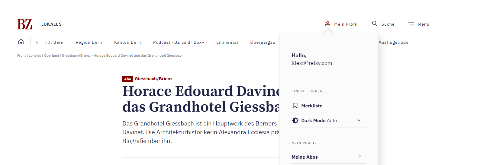

  

# BZCookieBear
 Read Berner Zeitung Abo Articles For Free

 
 # Manual

 Install the extension from the Chrome Web Store.

 When you open https://www.bernerzeitung.ch it will automatically log you in. This might take some time.

After that you'll be able to read Abo articles and you can see, that you are logged in as a random user.

